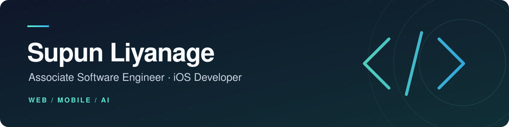

I build user-focused products for **web and mobile**, with a growing focus on **AI-assisted tools**.

Sri Lanka · BSc (Hons) IT — Software Engineering, SLIIT

[Projects](#selected-projects) · [Tech stack](#tech-stack) · [GitHub activity](#github-activity)

## A little about me

I work across the stack, from React and Next.js interfaces to Node.js and Spring Boot APIs, alongside native mobile development with SwiftUI and Kotlin. I care about clean architecture, secure APIs, and software that feels straightforward to use.

- **Working with:** SwiftUI, Next.js, and microservices architecture.
- **Building:** AI-assisted developer tools, including [CommitLoom](https://github.com/SupunLiyanage88/CommitLoom).
- **Open to:** Open-source collaboration and thoughtful product work.

## Selected projects

### [CommitLoom](https://github.com/SupunLiyanage88/CommitLoom)
**From staged changes to a clear commit message.**

A VS Code extension that generates conventional commit messages from your staged diff. Includes secret scanning, secure API key storage, and support for NVIDIA and OpenRouter models.

`TypeScript` · `VS Code API` · `NVIDIA NIM` · `OpenRouter`

### [FeedPulse](https://github.com/SupunLiyanage88/FeedPulse)
**Turn product feedback into actionable insights.**

A feedback platform with a public submission form and an admin dashboard. Gemini assists with categorization, sentiment, priority scoring, and weekly trend summaries.

`Next.js` · `Express` · `MongoDB` · `Gemini`

### [Syndicate Esports](https://github.com/SupunLiyanage88/syndicate-esports)
**Tournament management from registration to the final.**

The platform for Ascendant League Season 1, a Sri Lankan MLBB tournament. Covers roster registration, admin approvals, and automatically seeded brackets with score-based progression.

`Next.js` · `TypeScript` · `MongoDB` · `Tailwind CSS`

### More to explore

| Project | What it does | Built with |
| :--- | :--- | :--- |
| [iOS Mini Projects](https://github.com/SupunLiyanage88/IOS-Mini-Projects) | Native iOS experiments in animation, onboarding, weather UI, and trail risk prediction. | SwiftUI · Core ML |
| [RideOn](https://github.com/SupunLiyanage88/RideOn) | Rider safety app with live tracking, routing, and risk alerts. [Backend ↗](https://github.com/akilaManu-MaHiTo/rideon-server) | TypeScript |
| [BookHive](https://github.com/SupunLiyanage88/BookHive) | Library catalogue and rental management with JWT authentication. | React · Spring Boot · MySQL |
| [GlobePeek](https://github.com/SupunLiyanage88/GlobePeek) | Interactive country explorer with map-based browsing and synced favourites. | React · Firebase · REST Countries API |
| [BillCraft](https://github.com/SupunLiyanage88/BillCraft) | Invoice generation with no signup required. | React · TypeScript · MUI |
| [SpendSence V2.0](https://github.com/SupunLiyanage88/SpendSence_V2.0) | Android personal finance app; Firebase auth and persistence in progress. | Kotlin · Firebase |

[Browse all repositories →](https://github.com/SupunLiyanage88?tab=repositories)

## Tech stack

| Area | Technologies |
| :--- | :--- |
| **Languages** | TypeScript · JavaScript · Java · Swift · Kotlin · Python · C# |
| **Web** | React · Next.js · Vite · Tailwind CSS · MUI · Framer Motion |
| **Backend & auth** | Node.js · Express · Spring Boot · JWT · Keycloak |
| **Mobile & ML** | SwiftUI · Core ML · Android |
| **Data & tools** | MongoDB · MySQL · Firebase · Docker · Linux · Git |

## GitHub activity

[Explore my contributions and repositories →](https://github.com/SupunLiyanage88?tab=overview)

View GitHub stats

 

---

**Have something interesting in mind? Let's build it.**

[supunliyanage.dev](https://www.supunliyanage.dev/) · [LinkedIn](https://www.linkedin.com/in/supun-liyanage-600790223) · [Email me](mailto:liyanagesupun10@gmail.com)

